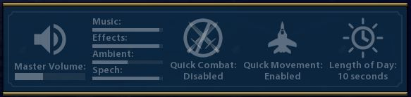

# Global Hotkeys v1.0.0

A mod that adds key bindings for quickly changing global settings rather than going through the game's option menu.
Plus some things not supported by the in-game options.

Adds keybindings for the following:
* Toggle quick unit combat (Ctrl+Alt+Q)

  Sometimes you want to see your swordsman gloriously hacking the last of Alexander's armies to shreds, but most of the time you just want to get on with the game.
* Toggle quick unit movement (Alt+Q)
* Increase/decrease/mute volume.  (Page Up/Page Down/Ctrl+Page Down)

  Additionally, Shift, Alt, Shift+Ctrl, Shift+Alt with Page Up/Page Down control the levels of the sound components: music, effects, ambient sounds, and voice.

* Increase/decrease in-game ambient time of day (Ctrl+Home/Ctrl+End)
* Increase/decrease in-game length of ambient time of day (Alt+Home/Alt+End)
* Toggle animated time of day (Alt+A)
* Increase/decrease minimap size (Shift+Home/Shift+End)
* Toggle city banner visibility (Alt+W)
* Toggle map tacks visibility (Alt+E)
* Toggle unit icons (Alt+R)
* Toggle heads up display/screenshot mode (Alt+T)

Using the keybindings to change volume or one of the other settings that does not immediately change the world view will briefly show a 
window with the current settings in the center of the screen.

### Installation
To use this mod you also need to have [Settings Manager](../SettingsManager) ([Steam workshop version](https://steamcommunity.com/sharedfiles/filedetails/?id=1564628360)).