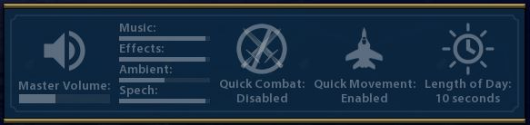

# Play the Keyboard: Global Hotkeys v1.0.0

Adds key bindings for quickly changing global settings rather than going through the game's option menu.
Plus some things not supported by the in-game options.

Adds keybindings for the following:
* Toggle quick unit combat (Ctrl+Alt+Q)

  Sometimes you want to see your swordsman gloriously hacking the last of Alexander's armies to shreds, but most of the time you just want to get on with the game.
* Toggle quick unit movement (Alt+Q)
* Increase/decrease/mute volume.  (Page Up/Page Down/Ctrl+Page Down)

  Additionally, Shift, Alt, Shift+Ctrl, Shift+Alt with Page Up/Page Down control the levels of the sound components: music, effects, ambient sounds, and voice.

* Toggle animated time of day (Alt+A)
* Increase/decrease in-game ambient time of day (Ctrl+Home/Ctrl+End)
* Increase/decrease in-game length of ambient time of day (Alt+Home/Alt+End)
* Increase/decrease minimap size (Shift+Home/Shift+End)
* Toggle city banner visibility (Alt+W)
* Toggle map tacks visibility (Alt+E)
* Toggle unit icons (Alt+R)
* Toggle heads up display/screenshot mode (Alt+T)

Using the keybindings to change volume or one of the other settings that does not immediately change the world view will briefly show a 
window with the current settings in the center of the screen.

### Installation 
* [Steam workshop](https://steamcommunity.com/sharedfiles/filedetails/?id=1637792345) 
* [Manual install](https://github.com/FiatAccompli/Civ6Mods/releases)

You also need to install:
* [Settings Manager](https://github.com/FiatAccompli/Civ6Mods/tree/master/SettingsManager) ([Steam workshop](https://steamcommunity.com/sharedfiles/filedetails/?id=1564628360)).
* [UI Plugins Framework](https://github.com/FiatAccompli/Civ6Mods/tree/master/UIPluginsFramework) ([Steam workshop](https://steamcommunity.com/sharedfiles/filedetails/?id=1632664596)).

### Compatibility
This mod should be compatible with most other mods. However, as with any mod, unforeseen 
conflicts may occur.

### Disclaimer
Sid Meier's Civilization VI, Civ, Civilization, 2K Games, Firaxis Games, and 
Take-Two Interactive Software are all trademarks and/or registered trademarks of 
Take-Two Interactive Software, Inc who do not sponsor, endorse, authorize or are 
in any other way associated with this mod.

This mod is provided "as is", without warranty of any kind, express or implied, 
including but not limited to the warranties of merchantability, fitness for a 
particular purpose and noninfringement. In no event shall the authors or copyright 
holders be liable for any claim, damages or other liability, whether in an action 
of contract, tort or otherwise, arising from, out of or in connection with the mod
or the use or other dealings in the mod.
