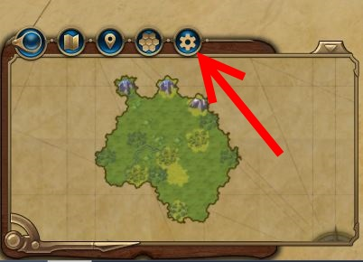
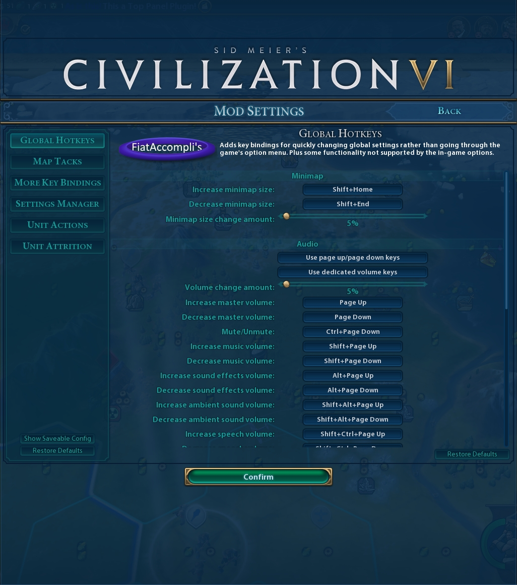

# Settings Manager v1.0.0

## Overview

Makes it easy for other mods to declare user configurable settings and gives users a nice UI to change those settings.
Setting values are persisted within game saves and if desired it is easy to save a set of global default values 
that apply across all saves.

## For Users

Settings Manager adds a fairly standard looking "options" pinwheel to the "toolbar" above the minimap.  



When clicked this opens the settings popup that allows you to change all settings declared by mods that use this framework.

*Note that your screen will not look exactly like this - the tabs and settings available depend on which mods you 
have installed that use this framework.*



After changing settings as desired, use the "Confirm" button at the bottom to lock in the changes.
Pressing ESC or the back button at the upper right will revert settings to the values present 
when the screen was opened.

### Saving settings as default for all games

To make the current settings the default for all games, click the "Show Saveable Config" button at the bottom
left of the settings popup and follow the in-game instructions.

## Installation
* [Steam workshop](https://steamcommunity.com/sharedfiles/filedetails/?id=1564628360)
* [Manual install](https://github.com/FiatAccompli/Civ6Mods/releases)

You also need to install [UI Plugins Framework](https://github.com/FiatAccompli/Civ6Mods/tree/master/UIPluginsFramework) 
([Steam workshop](https://steamcommunity.com/sharedfiles/filedetails/?id=1632664596)).

### Compatibility
This mod should be compatible with most other mods. However, as with any mod, unforeseen 
conflicts may occur.

### Disclaimer
Sid Meier's Civilization VI, Civ, Civilization, 2K Games, Firaxis Games, and 
Take-Two Interactive Software are all trademarks and/or registered trademarks of 
Take-Two Interactive Software, Inc who do not sponsor, endorse, authorize or are 
in any other way associated with this mod.

This mod is provided "as is", without warranty of any kind, express or implied, 
including but not limited to the warranties of merchantability, fitness for a 
particular purpose and noninfringement. In no event shall the authors or copyright 
holders be liable for any claim, damages or other liability, whether in an action 
of contract, tort or otherwise, arising from, out of or in connection with the mod
or the use or other dealings in the mod.


## For Modders

To use Settings Manager in other mods:

1. Add a dependency to your mod on Settings Manager.
   In Modbuddy go to Project Settings > Associations > Dependencies > Add Mod.
   Use Title = "Settings Manager" and Id = "1cb1beaf-0428-4aad-b11d-e3168429c071".
   If you're authoring the .modinfo by hand, then add the following within the root `Mod` element
   ```
   <Dependencies>
     <Mod id="1cb1beaf-0428-4aad-b11d-e3168429c071" title="Settings Manager" />
   </Dependencies>
   ```
   This makes it so users can't enable your mod without also enabling Settings Manager. 

2. In whichever lua files you want to use settings include the settings api
   ```
   include("mod_settings")
   ```
   and construct the settings you need.  All settings constructed will be automatically registered with the ui 
   and available for users to configure.

   Keybinding settings will also want to include the input matching code in `mod_settings_key_binding_helper.lua`.

*Note that mod settings can only control behavior of lua code - either UI behavior or custom behavior 
implemented with lua gameplay scripts.  You can't use the features of this mod to control changes made 
to the gameplay database.*

## Settings Api

Most of the settings api is found in the table `ModSettings`.  

### Members
* `ModSettings.Types` enumerates the available types.
* `ModSettings.PageHeader(categoryName, title, description, texture)` - Helper for registering page header 
  info for a category of settings.
  * `categoryName` - Identifier for the settings category
  * `title` - String to be used at the top of the settings tab.
  * `description` - Description of the mod.
  * `texture` - An logo for the mod.  Size should be 200*75 pixels.
* `ModSettings.Boolean`, `ModSettings.Select`, `ModSettings.Range`, `ModSettings.Text`, 
  `ModSettings.KeyBinding`, `ModSettings.Header`, `ModSettings.Action` - Classes for the various 
  types of settings.

### Settings Constructors
Settings are declared by calling a constructor of the form
```
ModSettings.<Type>:new(...)
```

#### Common constructor arguments

* `categoryName` - A localizable string that provides the name of the settings tab within the ui.
   It is recommended that this be similar to the mod name and that all settings in a mod use the same category.
   (If there are a lot of settings in a mod that logically group into separate categories then multiple 
   categories can be used.)
* `settingName` - A localizable string that provides the name of the individual setting within the ui.
  Setting names must be unique within a category.  If two settings use the same categoryName/settingName pair then the ui 
  assumes they are the same and will only show one of them in the ui. *If they don't have the same 
  definition (type, defaultValue, etc.) then bad things will probably happen.*
* `tooltip` - A localizable string that is used as a tooltip for the setting.  For example, to provide more 
  details about how the individual select items behave.  Optional and `nil` is a valid value if the setting 
  name is sufficiently explanatory.

#### Setting Members

* `Value` - This is how the current value of the setting is accessed by your mod code.  The current value can 
  also be retrieved with lua call syntax: (e.g. `value = mySetting()`).
* `Type` - The type of the setting as a member of `ModSettings.Types`.

#### Setting Methods

* `Change(value)` - Update the setting to the given value. *Note that this does not persist the change.*
* `AddChangedHandler(onChanged, callImmediately)` - Registers a function `onChanged(value, oldValue)` to be called 
  after the setting value has changed.  This is equivalent to adding a listener to 
  `LuaEvents.ModSettingsManager_SettingValueChanged` and filtering to matching categoryName/settingName.
  If `callImmediately` is true, then `onChanged` will also be invoked with only the current setting value.

### Setting Types

---

#### Boolean 

A simple true/false value.

```
setting = ModSettings.Boolean:new(defaultValue, categoryName, settingName, tooltip)
```

* `defaultValue` should be either true or false

The `Value` of the setting is `true` or `false`.

---

#### Selection 
Allows the user to choose the value from a provided list.

```
setting = ModSettings.Select:new(values, defaultIndex, categoryName, settingName, tooltip)
```

* `values` is a lua array of the values the user can select.  Each item is treated as a localizable string for display.
* `defaultIndex` is the index of the item within `values` that should be used as the setting default.

The `Value` of the setting is one of the strings from the `values` array.

---

#### Range
Allows the user to choose any value within a [min, max] range.
May be configured so that only regularly spaced values within the range are selectable.

```
setting = ModSettings.Range:new(defaultValue, min, max, categoryName, settingName, tooltip, options)
```
  
* `defaultValue` should be a number within [min, max].
* `min` and `max` define the limits of the range the user can select
* options is a table that supports the following:
  * `steps` restricts which values the user can select within the [min, max] range.  
    If `nil` the setting is continuous and the user can freely select any value in the range.  
    Otherwise it should be a positive integer and the range [min, max] is broken into `steps` 
    chunks such that the only user selectable values are `min + (max - min) / steps * k` for `k` in [0, steps].
  * `valueFormatter` is a localizable string that defines how to format the current value to give ui feedback.
    A reasonable default is provided if this is `nil`.

The `Value` of the setting is a number in [min, max].

---

#### Text
Allows the user to provide free-form text as the setting value.
```
setting = ModSettings.Text:new(defaultValue, categoryName, settingName, tooltip, onChanged)
```
* `defaultValue` should be a string

The `Value` of the setting is the user-provided string.

---
  
#### KeyBinding
Allows the user to bind a specific key (optionally with shift/control/alt modifiers)

```
setting = ModSettings.KeyBinding:new(defaultValue, categoryName, settingName, tooltip, options)
```
  
* `defaultValue` should be a value constructed with `MakeValue` or `nil` if no binding is specified.
  
The `Value` of the setting is a table with members `KeyCode`, `IsShift`, `IsControl`, and `IsAlt`.
    
##### Members
* `ModSettings.KeyBinding.MakeValue(keyCode, modifiers)` - 
  A static method to construct a data table to be used as the value of a key binding setting. 
  `keyCode` should be one of the values from the `Keys` table. (Note that not all keys in the `Keys`
  table are available for binding.  See the source for details.)  `modifiers` is a table containing 
  modifier key info. Set `Shift`, `Ctrl`, and/or `Alt` to true in it to require those modifier keys.
* `ModSettings.KeyBinding.ValueToString(value)` - 
  A static method to turn a value from `MakeValue` into a nicely localized string suitable for 
  displaying to the user.
* `ModSettings.KeyBinding.UNBOUND` - Constant to use if you don't want to bind a key by default.
  Never matches input.
* `KeyBindingHelper.InputMatches(value, input, options)` - From `mod_settings_key_binding_helper.lua`. 
  Returns true if `input` is a key event that matches the `value` of a key binding.
  * `value` is the `.Value` of a keybind setting.
  * `input` is the parameter passed to the function registered with `ContextPtr.SetInputHandler(handler, true)`.
  * `options` is a table that permits the following settings:
    * `InputContexts` is a set of the input contexts in which a match is allowed (e.g. world view, diplomacy, menus, etc). 
      See UI\Scripts\InputSupport.lua for contexts. If the ui is not in one of these contexts this method returns false.
      Default is only active in `World` input context.
    * `InterfaceModes` is a set of the interface modes that the binding is active in (as members of `InterfaceModeTypes`).
      If the ui is not in one of these modes this method returns false. Default is to only be active in `SELECTION` mode.
    * `Event` is the event to match, either `KeyEvents.KeyUp` or `KeyEvents.KeyDown`.  Default is `KeyUp`.
    * `AllowInPopups` determines whether a match is permitted if the ui is displaying a "popup".  This is anything displayed 
      via `UI.QueuePopup` (and also tech/civic trees, which, for who knows what reason, Firaxis choose not to implement 
      as true popups). Default is false.
    * `IgnoreModifiers` ignores shift/ctrl/alt matching between the binding and the current keyboard state.
      This is useful on key-up detection if you have an action that should take place throughout the duration 
      a key is held down and ends when the key is released.  (Without this the user can first press the key, 
      then press a modifier, and then release the key while holding the modifier resulting in the key-up not being 
      handled and the action stuck permanently taking place.)
* `KeyBindingHelper.IsInputStateMatch(options)` - from `mod_settings_key_binding_helper.lua`.
  Returns true if the current program state matches that in `options`. `options` can contain 
  `InputContexts`, `InterfaceModes`, and `AllowInPopups` as described for `InputMatches`.

---

#### Action

A psuedo-setting that shows up in the configuration UI as a clickable button.  By attaching a callback 
with AddChangedHandler you can attach custom behavior into the UI configuration popup.  For example, 
if you were providing a key-binding mode for world view you could have individual keybinding settings to 
move the world view up/down/left/right and zoom-in/zoom-out.  You could then add two custom action "settings"
to set those keybindings to recommended values of up/down/left/right/+/- or w/s/a/d/r/f.

```
setting = ModSettings.Action:new(categoryName, settingName, tooltip)
```

The `Value` of the setting is meaningless.

---

#### Header

A psuedo-setting that shows up in the configuration UI as a section header.

```
setting = ModSettings.Header:new(categoryName, settingName, tooltip)
```

The `Value` of the setting is meaningless.

---

### Setting ordering
All settings with the same `categoryName` are grouped into a single 'tab' in the configuration UI.  For settings 
declared within a single file the order in the configuration UI will be the same as the order the settings are declared 
in the file.  For multiple files that use the same `categoryName` the ordering of settings from these files 
is random (all the settings from each file will appear together and in the order stated previously).

### Events

* `LuaEvents.ModSettingsManager_SettingValueChange(categoryName, settingName, value)` -
  Called when the setting value has been changed by the ui or programmatically.  Allows setting objects to update their 
  publicly exposed `Value` to the new value.  You probably don't need to interact with this.
* `LuaEvents.ModSettingsManager_SettingValueChanged(categoryName, settingName, value, oldValue)` - 
  Called *after* settings have had values updated via the ModSettingsManager_SettingValueChange event.
  This is generally the only event you need to interact with.  The convenience helper `AddChangedHandler` 
  is the preferred way to interact with this event.
* `LuaEvents.ModSettingsManager_UIReadyForRegistration()` - Called by the popup ui to trigger registration of settings.
  You probably don't need to interact with this.  Settings automatically handle this event.
* `LuaEvents.ModSettingsManager_RegisterSetting(setting)` - Called by settings to register themselves with the ui.
  You probably don't need to interact with this.  Settings automatically handle this event.
* `LuaEvents.ModSettingsManager_RegisterPageHeader(categoryName, title, description, texture)` - Called to register 
  a page header with the ui. The convenience function `ModSettings.PageHeader` is the preferred way 
  to interact with this event.

### Examples
See [SettingsManagerExample](../SettingsManagerExample) for a very simple mod that declares settings 
(but doesn't really do much with them).

For more advanced usages check out the other mods in this repository.