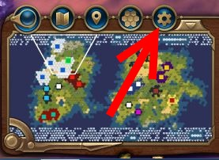

# Mod Settings Manager v1.0.0

## Overview

Provides an easy way for other mods to declare user configurable settings and provides a ui for the user to change setting values. 
Setting values are persisted within game saves and if the user desires it is (relatively) easy to save a global default setting 
that applies across all saves.

## For Users

Mod Settings Manager adds a fairly standard looking "options" pinwheel to the "toolbar" above the minimap.  
When clicked this will bring up the settings popup that allows you to change all settings declared by other mods.  
When you have changed the settings use the "Confirm" button at the bottom to lock in the changes 
(if you press ESC or the back button at the upper right) the changes will be reverted.




### Saving settings as the default for all games.

To make the current settings the default for all games, click the "Show Saveable Config" button at the bottom
left of the settings popup.  Follow the in-game instructions.

## For Modders

To use Mod Settings Manager in other mods:

1. Add a dependency to your mod on Mod Settings Manager.
   In Modbuddy go to Project Settings > Associations > Dependencies > Add Mod.
   Use Title = "Mod Settings Manager" and Id = "1cb1beaf-0428-4aad-b11d-e3168429c071".
   If you're authoring the .modinfo by hand, then add the following within the root `Mod` element
   ```
   <Dependencies>
     <Mod id="1cb1beaf-0428-4aad-b11d-e3168429c071" title="Mod Settings Manager" />
   </Dependencies>
   ```
   This makes it so users can't enable your mod without also enabling Mod Settings Manager. 

2. In whichever lua files you want to use settings include the settings api
```
include ("ModSettings")
```
and contruct the settings you need to control.  All settings constructed will be automatically registered with the ui 
and available for users to configure.

*Note that mod settings can only control behavior of lua code - either UI behavior or custom behavior 
 implemented with lua gameplay scripts.  You can't use this mod to control changes made to the gameplay database.*

## Settings Api

### Comman Api

Settings are declared by calling a constructor of the form
```
ModSettings.<Type>:new(...)
```

#### Common constructor arguments

* `categoryName` - A localizable string that provides the name of the settings tab within the ui.
   It is recommended that this be similar to the mod name and that all settings in a mod use the same category.
   (If there are a lot of settings in a mod that logically group into separate categories then multiple 
   categories in a mod are reasonable.)
* `settingName` - A localizable string that provides the name of the individual setting within the ui.
  All setting names must be unique.  If two settings use the same categoryName/settingName pair then the ui 
  assumes they are the same and will only show one of them in the ui. *If they don't have the same 
  definition (type, defaultValue, etc.) then bad things will probably happen.*
* `tooltip` - A localizable string that is used as a tooltip for the setting.  For example, to provide more 
  details about how the individual select items behave.  `nil` is a valid value if the setting name is sufficiently explanatory.

#### Setting Members

* `Value` - This is how the current value of the setting is accessed by your mod code.
* `Type` - The type of the setting as a member of ModSettings.Types.

#### Setting Methods

* `Change(value)` - Update the setting to the given value. 
* `AddChangedHandler(onChanged)` - Register a function to be called after the setting value has changed.
  This is equivalent to adding a listener to `LuaEvents.ModSettingsManager_SettingValueChanged` and filtering
  to matching categoryName/settingName.
  
#### Events

* `LuaEvents.ModSettingsManager_SettingValueChange(categoryName, settingName, value)` -
  Called when the setting value has been changed by the ui or programmatically.  Allows setting objects to update their 
  publicly exposed `Value` to the new value. Modders should not need to interact with this.
* `LuaEvents.ModSettingsManager_SettingValueChanged(categoryName, settingName, value)` - 
  Called *after* settings have had values updated via the ModSettingsManager_SettingValueChange event.
  This is generally the only event modders need to care about.  The convenience helper `AddChangeHandler` 
  on settings objects is the preferred way to interact with this event.
* `LuaEvents.ModSettingsManager_UIReadyForRegistration()` - Called by the popup ui to trigger registration of settings.
  Modders should not need to interact with this.
* `LuaEvents.ModSettingsManager_RegisterSetting(setting)` - Called by settings to register themselves with the configuration UI.
  Modders should not need to interact with this.

### Setting Types

---

#### Boolean 

A simple true/false value

```
setting = ModSettings.Boolean:new(defaultValue, categoryName, settingName, tooltip)
```

* `defaultValue` should be either true or false

The `Value` of the setting is `true` or `false`.

---

#### Selection 
Allows the user to choose the value from a provided list.

```
setting = ModSettings.Select:new(values, defaultIndex, categoryName, settingName, tooltip)
```

* `values` is a lua array of the values the user can select.  Each item is treated as a localizable string for display.
* `defaultIndex` is the index of the item within `values` that should be used as the setting default.

The `Value` of the setting is one of the strings in the `values` array.

---

#### Range
Allows the user to choose any value within a [min, max] range.
May be configured so that only regularly spaced values within the range are selectable.

```
setting = ModSettings.Range:new(defaultValue, min, max, steps, 
    categoryName, settingName, tooltip, valueFormatter)
```
  
* `defaultValue` should be a number within [min, max].
* `min` and `max` define the limits of the range the user can select
* `steps` restricts which values the user can select within the [min, max] range.  
If `nil` the setting is continuous and the user can freely select any value in the range.  
Otherwise it should be a positive integer and the range [min, max] is broken into `steps` 
chunks such that the only user selectable values are `min + (max - min) / steps * k` for `k` in [0, steps].
* `valueFormatter` is a localizable string that defines how to format the current value to give ui feedback.
A reasonable default is provided if this is `nil`.

The `Value` of the setting is a number in [min, max].

---

#### Text
Allows the user to provide free-form text as the setting value.
```
setting = ModSettings.Text:new(defaultValue, categoryName, settingName, tooltip, onChanged)
```
* `defaultValue` should be a string

The `Value` of the setting is the user-providede string.

---
  
#### KeyBinding
Allows the user to bind a specific key (optionally with shift/control/alt modifiers)

```
setting = ModSettings.KeyBinding:new(defaultValue, categoryName, settingName, tooltip)
```
  
* `defaultValue` should be a value constructed with `MakeValue` or `nil` if no binding is specified.  
  **To avoid conflicts with base game bindings it is recommended that 
  all defaults for mod key bindings use at least one of the shift/ctrl/alt modifiers**.
    
##### Methods
* `ModSettings.KeyBinding.MakeValue(keyCode, isShift, isControl, isAlt)` - 
  A static method to construct a data table to be used as the value of a key binding setting. 
  `keyCode` should be one of the values from the `Keys` table.  (Note that not all values in the `Keys`
  table are available for binding.  See the source for details.)  
* `MatchesInput(input)` - Returns true if `input` is a key-up event that matches the currently configured key binding.
  `input` is the parameter passed to the function registered with `ContextPtr.SetInputHandler(handler, true)`.
    
    
### Examples
See [SettingsManagerExample](../SettingsManagerExample) for a very simple mod that declares settings 
(but doesn't really do much with them).
For more advanced usages check out the other mods in this repository.