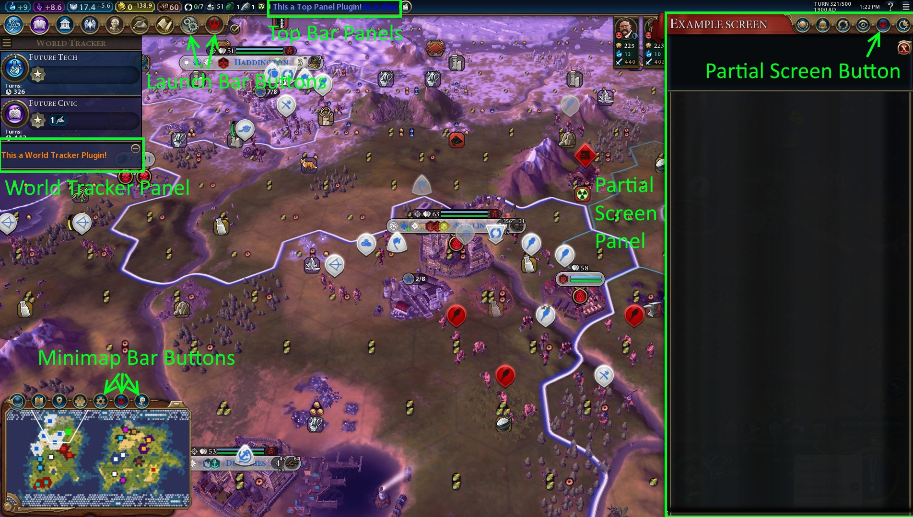

# UI Plugins Framework v1.0.0

## Overview
Makes it easy for other mods to add UI elements to parts of the in-game UI without needing 
to overwrite the base game UI files. This makes mods simpler and reduces the chances they 
are incompatible with one another.

## For Users

### Installation
* [Steam workshop](https://steamcommunity.com/sharedfiles/filedetails/?id=1632664596)
* [Manual install](https://github.com/FiatAccompli/Civ6Mods/releases)

### Compatibility
This mod should be compatible with mods that do not touch the UI (e.g. city state, 
civilization, and other db level mods).  It will likely conflict with mods that touch 
the same parts of the UI that this mod does (and do not use the framework provided by 
this mod).  As with any mod, unforeseen conflicts may occur.

### Disclaimer
Sid Meier's Civilization VI, Civ, Civilization, 2K Games, Firaxis Games, and 
Take-Two Interactive Software are all trademarks and/or registered trademarks of 
Take-Two Interactive Software, Inc who do not sponsor, endorse, authorize or are 
in any other way associated with this mod.

This mod is provided "as is", without warranty of any kind, express or implied, 
including but not limited to the warranties of merchantability, fitness for a 
particular purpose and noninfringement. In no event shall the authors or copyright 
holders be liable for any claim, damages or other liability, whether in an action 
of contract, tort or otherwise, arising from, out of or in connection with the mod
or the use or other dealings in the mod.


## For Modders
Currently this mod supports two types of plugin points.
* Addition of toolbar buttons
* Addition of arbitrary panels in elements of the UI.

The following image shows the available plugin points.



To use UI Plugins Framework in other mods:

1. Add a dependency to your mod on UI Plugins Framework.
   In Modbuddy go to Project Settings > Associations > Dependencies > Add Mod.
   Use Title = "UI Plugins Framework" and Id = "c8e215b9-b317-4fae-a9b5-907570575893".
   If you're authoring the .modinfo by hand, then add the following within the root `Mod` element
   ```
   <Dependencies>
     <Mod id="c8e215b9-b317-4fae-a9b5-907570575893" title="UI Plugins Framework" />
   </Dependencies>
   ```
   This makes it so users can't enable your mod without also enabling Settings Manager. 

2. Use the plugin points.

### Panel plugin points
Panels can be added to the:
* Top panel
* World tracker

Additionally two additional plugin points for full-screen "panels" are provided that allow mods to 
add arbitrary UI at different points in the z-axis hierarachy of controls.

Panels are added to the game through an `AddUserInterface` within the `.modinfo` file, in the standard
manner of adding a normal mod user interface.  The difference is that rather than using a `Context` 
of `InGame` the following values are used in its place.
* `InGame_Screen` - Adds a context within the `Screens` element of `InGame`.
  Which means it is (on the z-axis) below the launch bar and a few other parts of the ui 
  such as popups.
* `InGame_PartialScreen` - Adds a context within the `PartialScreens` element of `InGame`.
  Which means it is (on the z-axis) below the partial screen toolbar as well as the launch 
  bar and a few other top-level ui elements (e.g. popups).
* `InGame_TopPanel` - Adds a custom panel to the info bar at the top of the screen (the one 
  that contains overall civilization yields and some other things).
* `InGame_WorldTracker` - Adds a custom panel within the world tracker (the left side of the 
  screen that contains tech/civic and emergency panels (for Rise+Fall)). Expand/collapse 
  functionality and a header is automatically added to world tracker plugins to build 
  the complete panel the user sees.

In the case of `InGame_TopPanel` and `InGame_WorldTracker` plugin points it is necessary to
explicitly control the size of the top-level control (`ContextPtr` in lua code) as it
seems that specifying a `Size` setting in the xml on the top-level Context has no effect, nor 
does auto-sizing work.  The easiest way to do this is to have only a single control immediately 
within the Context and set the size of the Context to the size of this control.  For example:

```
ContextPtr:SetSizeX(Controls.Panel:GetSizeX());
ContextPtr:SetSizeY(Controls.Panel:GetSizeY());
```

To fit nicely within their containers, plugins should use the following dimensions:
* `InGame_TopPanel` plugins should use a height of 25 pixels and arbitrary width.
* `InGame_WorldTracker` plugins should use a width of 292 pixels and arbitrary height.

For world tracker plugins you also need to:
* Specify a `Name="something"` on the top-level `Context` element in the UI xml file. 
  This string (after localization) is used as the name of the panel in its header 
  (and also the name of the panel within the dropdown menu for the world tracker).
* Use a background color of `30,32,64,228`.  Or not.  That's the color used in the 
  header so using it will give your panel a nice seamless look.  Not a requirement though, 
  if you want a different look you can do so.

### Button plugin points
Buttons can be added to the:
* Launch bar ("toolbar" at top left with tech/civic/government/etc buttons).
* Partial screen bar ("toolbar" at top right with city states/trade routes/etc buttons).
* Minimap bar ("toolbar" at bottom left above minimap with lenses/strategy view/map tack/etc buttons).

Addition of buttons to the various toolbars is handled through the LuaEvents system. 
The first two events deal with button registration:
* `LuaEvents.TYPE_RegisterAdditions` - Event notified when it is appropriate to register custom
  buttons with the toolbar.  You should also register the buttons in your context initialization 
  routine.  This setup ensures that buttons are registered and show up regardless of the 
  order of initialization of the contexts.  (And also that buttons are registered when 
  you're working on authoring a mod and it gets reloaded.)
* `LuaEvents.TYPE_AddButton` - Event you call to add a custom button passing as an argument
  a specification for the button.

The third event deals with buttons being clicked:
* `LuaEvents.TYPE_CustomButtonClicked` - Event notified when a custom button is clicked and 
  to which your code reacts and takes whatever action it desires.

#### Launch bar buttons
* `LuaEvents.LaunchBar_RegisterAdditions()`
* `LuaEvents.LaunchBar_AddButton(buttonInfo)` - `buttonInfo` is a table that supports the 
  following properties.
  * `Id` - A string used to identify the button.
  * `IconTexture` - Table containing the specification for the icon to be displayed in the button.
    * `Sheet` - String name of a texture to use as the button icon.
    * `OffsetX`, `OffsetY` - Optional texture offsets.
    * `Icon` - String name of the icon to be used for the button.  An alternative to `Sheet`.
    * `Color` - Optional foreground color for the icon/texture.
  * `BaseTexture`- Table containing the specification for the backgound of the button
    * `Sheet` - String name of a texture to use for the background.  Should probably be 
      one of the "LaunchBar_Hook_XXX" textures from the pantry unless you're really motivated 
      to draw a custom one.
    * `OffsetX`, `OffsetY` - Optional texture offsets.
    * `HoverOffsetX`, `HoverOffsetY` - Optional texture offsets when moused-over.
  * `Tooltip` - Optional tooltip for the button.
* `LuaEvents.LaunchBar_CustomButtonClicked(id)` - `id` is the identifier from the specification
  used to construct the button.

Launch bar buttons are generally intended to launch mutually exclusive full-screen UI.
To support this standard use case a couple of extra events are involved.  (If using a launch 
bar button for a different purpose you don't need to interact with these.)
* `LuaEvents.LaunchBar_CloseAllExcept(id)` - Notified whenever a launchbar screen 
  is toggled on.  If the id of your custom screen is not the `id` argument then you should 
  close your screen (if it is open).
* `LuaEvents.LaunchBar_EnsureExclusive(id)` - If you open your launch bar screen through a method 
  other than via a click of the launch bar button (such as through a hotkey) then you should 
  invoke this event to ensure that all other launch bar screens are closed.

#### Partial screen bar buttons
* `LuaEvents.PartialScreenHooks_RegisterAdditions()`
* `LuaEvents.PartialScreenHooks_AddButton(buttonInfo)` - `buttonInfo` is a table that supports the 
  following properties.
  * `Id` - A string used to identify the button.
  * `Sheet` - String name of a texture to use as the button icon.
  * `Icon` - String name of the icon to be used for the button.  An alternative to `Sheet`.
  * `Color` - Optional foreground color for the icon/texture.
  * `Tooltip` - Optional tooltip for the button.
* `LuaEvents.PartialScreenHooks_CustomButtonClicked(id)` - `id` is the identifier from the specification
  used to construct the button.

Partial screen buttons are generally intended to launch mutually exclusive partial screen UI on the 
right side of the screen.  To support this standard use case an extra event is involved.  (If using a 
partial screen button for a different purpose you don't need to interact with it.)

* `LuaEvents.PartialScreenHooks_CloseAllExcept(id)` - Notified whenever a partial screen 
  is toggled on.  `id` is the identifier from the specification used to construct the button
  and identify the screen (or is one of the built-ins used by the game).  If you open 
  your partial screen through a method other than via a click of the button (such as a hotkey)
  then you should invoke this event to ensure that all other partial screens are closed.

#### Minimap bar buttons
* `LuaEvents.MinimapBar_RegisterAdditions()`
* `LuaEvents.MinimapBar_AddButton(buttonInfo)` - `buttonInfo` is a table that supports the 
  following properties.
  * `Id` - A string used to identify the button.
  * `Sheet` - String name of a texture to use as the button icon.
  * `Icon` - String name of the icon to be used for the button.  An alternative to `Sheet`.
  * `Color` - Optional foreground color for the icon/texture.
  * `Tooltip` - Optional tooltip for the button.
* `LuaEvents.MinimapBar_CustomButtonClicked(id)` - `id` is the identifier from the specification
  used to construct the button.

### Examples
See [UIPluginsExample](../UIPluginsExample) for a simple mod that has examples of all the 
plugins points provided by this mod.